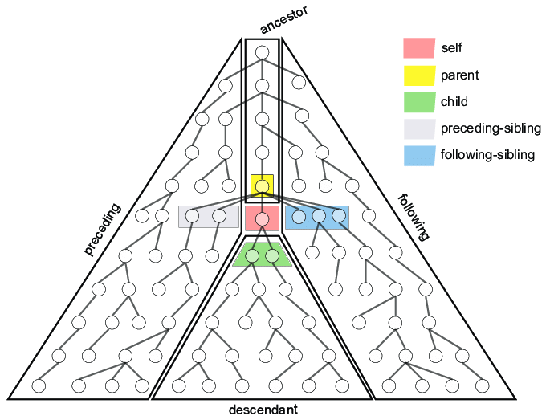

# XPath

[XML Path Language (XPath) 3.1](https://www.w3.org/TR/2017/REC-xpath-31-20170321/)

## Definición

**XPath** es un estándar W3C que utiliza expresiones de [ruta](#ruta) para navegar en documentos XML que contiene una biblioteca de funciones estándar

## Retorno

La evaluación de las expresiones devuelven:

- secuencias de nodos
- valores lógicos
- númericos
- cadena de caracteres

### Rutas <a name="ruta"></a>

#### XPath

Solo considera una ruta absoluta después de 4 puntos e igual **::=**
```
<xpath> ::= [ <rutaAbosluta> | <expresion>]
```

#### Ruta abosluta
Es obligatoriamente una barra "/" y entre 0 y N ruta(s) relativas separadas también por "/"
```
<rutaAbosluta> ::= /[<rutaRelativa>{/<rutaRelativa>}*]
```

#### Ruta relativa

Es una prueba, que opcionalmente puede tener antes un [eje](#eje) y después un predicado. Dicho de otra forma: Es opcionalmente un eje, obligatoriamente una prueba y opcionalmente un predicado

```
<rutaRelativa> ::= [ <eje> ] <prueba> [ <predicado> ]
```

#### Eje <a name="eje"></a>

Representa una lista de nodos dependiente al nodo contextual, el nodo contextual equivale al eje: self.

1. self
2. parent
3. child
4. preceding-sibling
5. following-sibling
6. preceding
7. ancestor
8. following
9. descendant
10. namespace
11. attribute

| Palabras reservadas              | Ejemplo con más nodos             |
| -------------------------------- | --------------------------------- |
|  |  |

```
<eje> ::= ( self | parent | child | preceding-sibling | following-sibling | preceding | ancestor | ancestor-or-self | following | descendant | descendant-or-self | namespace | attribute ) :: | . | .. | @
```

- **namespace**, lista de nodos con el espacio de nombres del nodo contexto
- **attribute**, lista de nodos con atributos del nodo contexto

(i) Se numera el nodo recursivamente de izquierda a derecha cada uno de los hijos con números consecutivos

#### Prueba <a name="pruebas"></a>

Se filtra del conjunto de nodos, aquellos que cumplan la prueba por nombre, mediante un identificador o tipo, node() o text(), ...

Una de las siguientes:
- identificador, la etiqueta que estamos buscando en el XML. P. ej. country
- un nodeO un nodo completo

```
<prueba> ::= <identificador> | node() | text() | * | *@
```

#### Predicado <a name="predicado"></a>

Meter entre corchetes una expresión booleana

```
<predicado> ::= [ <expresion> ]

<expresion> ::= <valor> | <expresion> <operador> <expresion> | <identificador> ( { <expresion> | <rutaAbsoluta> | <rutaRelativa> } )

<operador> ::= and | or | = | != | < | < | > | > | + | - | * | div

<xpath> ::= <expresion>

```


## Práctica

- https://www.freeformatter.com/xpath-tester.html

- [countries.xml](data.xml)

Todos los nodos name de los países con población superior a la media
```
/countries/country[(sum(//population) div count(//country)) < ./population]/name
```

Todos los nodos con población mayor que todos los nodos del eje namespace. Espero tener un conjunto de un solo nodo, o todos los empatados con mayor población

```
/countries/country/population[./text() = max(/countries/country/population/text()) ]/../name/text()
/countries/country/latlng[./text() = max(/countries/country/latlng/text()) ]/../name/text()


```